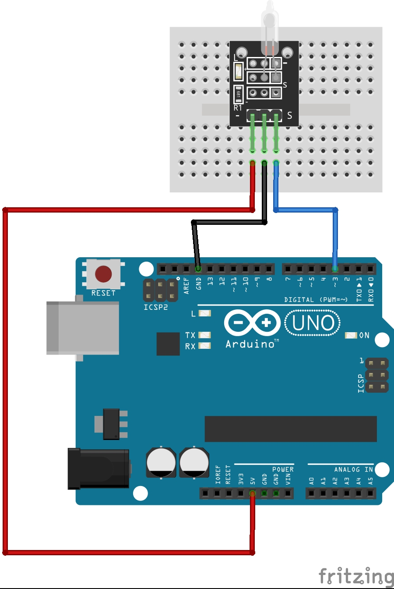

# Tilt switch

A tilt switch is a simple component that acts like a switch controlled by orientation instead of a button press. Inside, a small metal ball (or a mercury bead in older versions) rolls freely inside a cavity with two contacts. When the switch is tilted past a certain angle, the ball rolls onto the contacts and closes the circuit; when it's tilted back, the ball rolls away and the circuit opens.

At hackSpace we have two module types:

- 3-pin module (no LED)

- [4-pin module (with LED)](https://arduinomodules.info/ky-027-magic-light-cup-module/)

---
## HARDWARE

- Arduino UNO

- Tilt switch (any)

- LED

---
## WIRING

 

---
## CODE and INSTRUCTIONS

